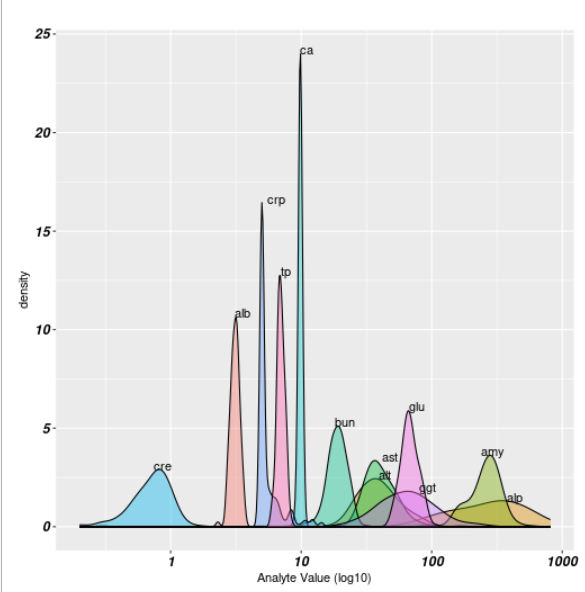
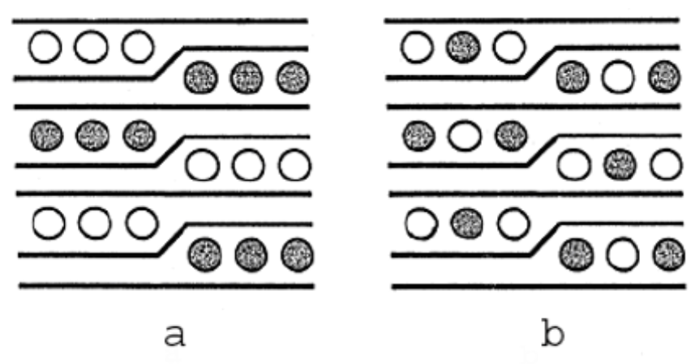

#Label points on a density plot with the max value of the density curve.

<p>

 </p>


```r
p<-ggplot(product,aes(x=value, group=analyte, fill=analyte)) +
geom_density(adjust=1.5, alpha=.4) +
scale_x_log10()+
  theme(legend.position="none",
     axis.text=element_text(size = 12, color = "black", face = "bold.italic"))+    
ylab("density") +
xlab("Analyte Value (log10)") %>% 

###pull out the numbers from the generated graph to be able to plot the values.

 ggplot_build() %>% 
  `[[`("data") %>% 
  `[[`(1) %>% 
  as_tibble() %>% 
  group_by(group) %>% 
summarise(max=max(y))
```


General Excel work
```vbscript
'General cleanup
Sub Macro1()
  Range("d3").Activate
    i = 56
    Do While i > 0
  ActiveCell.Range("A1:L1").Copy
  ActiveCell.Offset(-1, 12).Select
  ActiveSheet.Paste
   ActiveCell.Range("A2").EntireRow.Delete
    ActiveCell.Offset(2, -12).Select
    i = i - 1
   Loop
End Sub
```

Excel interweave-intercalating cells in spreadsheet:
<p>

</p>

```vbscript
=INDEX($A$1:$B$5,QUOTIENT(ROW()+1,2),IF(MOD(ROW(),2)=0,2,1))
```


#Transposition of data in an excel spreadsheet in a while loop

```vbscript
Excel transpose TRUDEAU:
Sub Macro1()
' Macro1 Macro
   Range("B:C, F:N").UnMerge
    Range("F:I, K:L, N:N").EntireColumn.Delete
    Range("F:G").EntireColumn.Insert
    Range("e1").Value = ActiveSheet.Name & "_1"
    Range("F1").Value = ActiveSheet.Name & "_2"
    Range("G1").Value = ActiveSheet.Name & "_3"
    
    Range("e2").Activate
   
    i = 25
    Do While i > 0
    
    ActiveCell.Range("B1:C1").Value = WorksheetFunction.Transpose(ActiveCell.Range("A2:A3"))
   ActiveCell.Range("A2:A3").EntireRow.Delete
    ActiveCell.Offset(1, 0).Select
    i = i - 1
   Loop

Range("B2").Activate
j = 10
Do While j > 0

ActiveCell.Range("A2:A5").Value = ActiveCell.Range("a1")
ActiveCell.Offset(5, 0).Activate
j = j - 1
Loop

Range("E:E").EntireColumn.Insert
Range("I:J").Copy
Range("D:E").Activate
ActiveSheet.Paste
Range("I:J").EntireColumn.Delete
Range("b1").Value = "group"
Range("c1").Value = "pid"
Range("d1").Value = "cells_well"
Range("e1").Value = "cells_spleen"
End Sub
```

