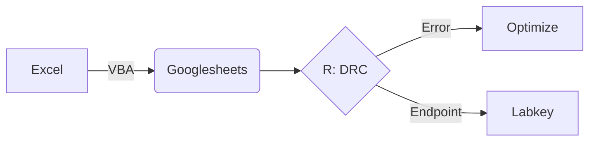
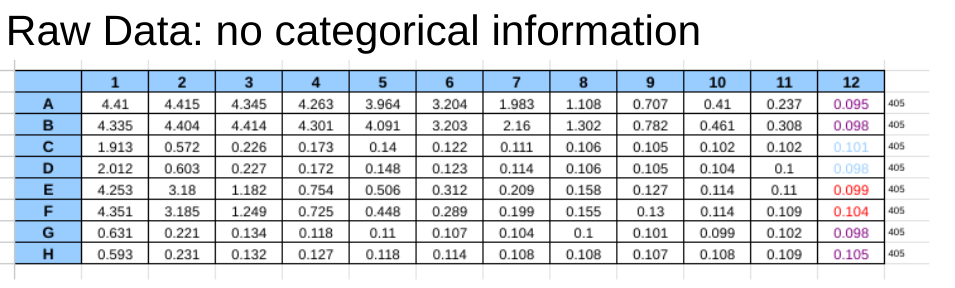
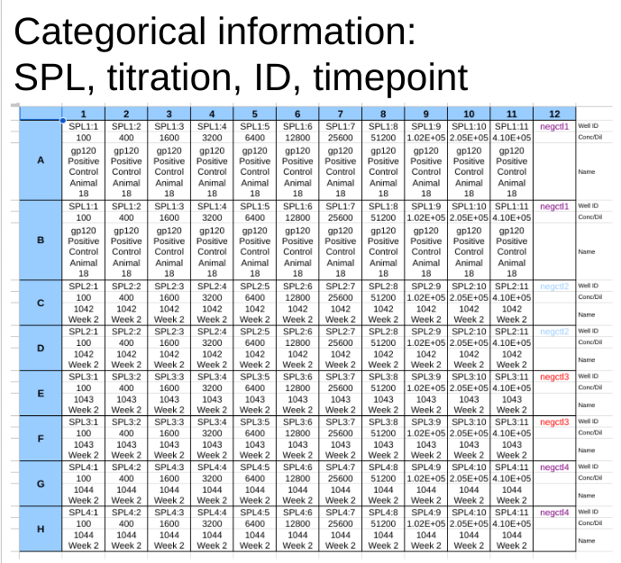
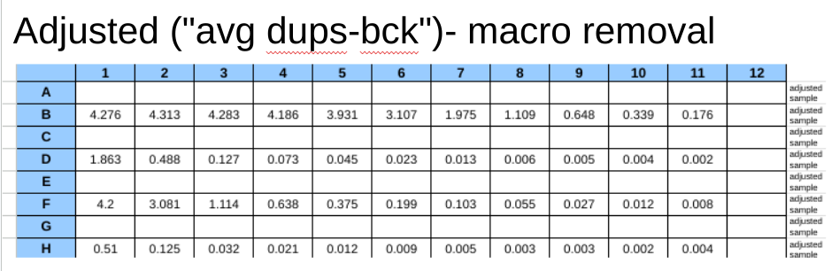
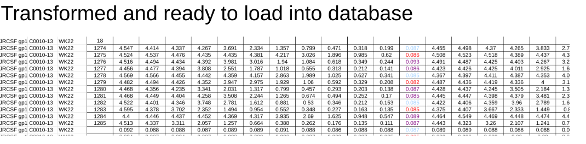

### Making the machine output more database friendly
with a longitudinal study it is important to wrangle the data of a machine output into a format that is structured in order to populate a database and execute commands on it (commands can be EDA, [curve fitting](https://github.com/aaronjwilson/immuno_data_analysis/blob/master/ELISA_DRC.md), or graphical outputs. as many of the machine outputs are already populated in excel the importance of using VBscripting becomes tantamount. 

We will follow the first part of the below flow chart using the excel spreadsheet from the machine output paired with a VBscript to transform the data into a structure suitable for db schema: 


This will arrive at the destination of a dataset that is analyzed, aggregated, web accessible data set with advanced agile graphical outputs like the following: 

<p align="center">

</p>
To get a sense of the remaining steps visit the dose response curve calculation steps in the ELISA_DRC section.

For this part i will focus on developments in excel vbscript but future discussions will follow the development of bespoke methods using alternative scripting/programming languages such as: 

R/Python<br>
Macros made in javascript for googlesheets or O365.

###VBSCIPTING<br>
when thinking about the tools that i use on the regular to bring data into a format that allows the easiest and most efficient method of getting the most amount of detail. timing is of the ssesnce. Excel is a great program. extended with visual basic is even better. looking at the structure of commonly derived and well mapped ELISA data the excel spreadsheets from BioTeks Gen5 software look like the following. <br>


<p align="center">

</p>
<p align="center">  

</p>
<p align="center">

</p>

A great software when properly applied but looking at biological data in a siloed fashion is decontextualized and does not capture the essence of labeled, parsed, and facetted longitudinal data. The full picture emerges from aggregation and software applications such as graphpad prism work very well for visualizing this but the software is costly and neglects advances in database technology paired with a programmatic language like R or Python. 

To begin the tranformation: we want create vbscript to combine the raw and categorical and output a database ready structure like this: 
<p align="center">

</p>


To begin the work the structure of the data must be analyzed and either established or created. VBscript for an excel macro to interact with the elisa data. Started with removal of empty rows. Nonlinear program with the function created in a subroutine pitched well below the machination work. 
```vbscript
Sub Gen5Row()

' loopish Macro
Range("A1:A1700").Select
Application.Run "DelEmptyRow"
```

Next define a starting point and let the voodoo happen on loop. 
```vbscript
Range("B3").Select
Do Until IsEmpty(ActiveCell.Offset(22, -1))
    ActiveCell.Range("A1,A4,A7,A10,A13,A16,A19,A22").Select
    Selection.Copy
    ActiveCell.Offset(22, -1).Range("A1").Select
    ActiveSheet.Paste
    ActiveCell.Offset(1, 1).Range("A1:L1").Select 'active cell A25
    Application.CutCopyMode = False
    Selection.Cut
    ActiveCell.Offset(-1, 12).Range("A1").Select
    ActiveSheet.Paste
        For i = 1 To 3
            ActiveCell.Offset(3, -12).Range("A1:L1").Select
            Selection.Cut
            ActiveCell.Offset(-1, 12).Range("A1").Select
            ActiveSheet.Paste
        Next i
   ActiveCell.Offset(12, -12).Range("A1").Select
Loop
```
Another reference to the deletion of empty rows.
```vbscript
    Range("O1:O1500").Select
    Application.Run "DelEmptyRow"
```


Nomenclature built around direct naming and the name built into the sheet tab
```vbscript
Range("A1").EntireRow.Insert
Range("A:C").EntireColumn.Insert
Range("A1")="Protein"
Range("B1")="StudyID"
Range("C1")="Timepoint"
Range("D1")="Participantid"
Range("A2:A30") = Mid(ThisWorkbook.Name, 10, 15)
Range("B2:B30") = Mid(ThisWorkbook.Name, 1, 8)
Range("C2:C30") = ActiveSheet.Name
End Sub
```


##LOOK HERE FOR THE SUBROUTINE USED TWICE ABOVE
```vbscript
'Attribute VB_Name = "DelEmptyRow"
Sub DelEmptyRow()
Rng = Selection.Rows.Count
ActiveCell.Offset(0, 0).Select
Application.ScreenUpdating = False
For i = 1 To Rng
If ActiveCell.Value = "" Then 
Selection.EntireRow.Delete
Else
ActiveCell.Offset(1, 0).Select
End If
Next i
Application.ScreenUpdating = True
End Sub
```
Sandbox to test out nomenclature subroutine.  Data ended up being so different between studies the manual method worked the best. 
```vbscript
Sub FileNomen()
'Range("A2") = Mid(ThisWorkbook.Name, 10, 15)
'Range("B2") = Mid(ThisWorkbook.Name, 1, 8)
'Range("C2") = ActiveSheet.Name
'Range("A2") = Mid(ThisWorkbook.Name, 12, 16)
'Range("B2") = Mid(ThisWorkbook.Name, 1, 10)

End Sub
```


links: 
https://upmath.me/


