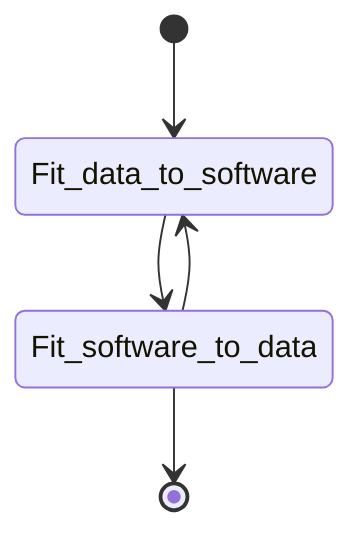

# Wrangling
Musings on Data munging

some thoughts on the process of getting data into a format that works best for getting the most information (graphical output, EDA, statistical measures)

```mermaid
stateDiagram
    [*] --> Fit_data_to_software
   

    Fit_data_to_software --> Fit_software_to_data
    Fit_software_to_data --> Fit_data_to_software
  
   Fit_software_to_data  --> [*]
```
