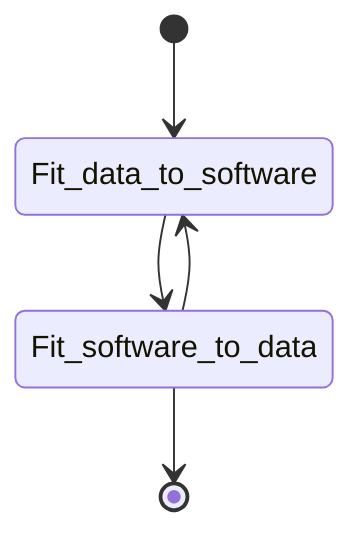

# Wrangling
Musings on Data munging

some thoughts on the process of getting data into a format that works best for getting the most information (graphical output, EDA, statistical measures)

when thinking about the tools that i use on the regular to bring data into a format that allows the easiest and most efficient method of getting the most amount of detail. timing is of the ssesnce. Excel is a great program. extended with visual basic is even better.  

GraphPad 
R 
Python 
Googlesheets macros.
