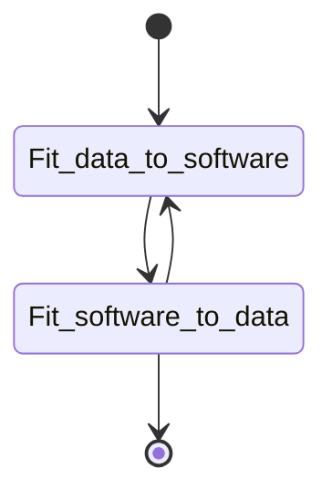
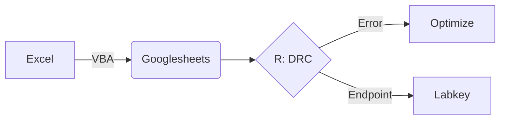
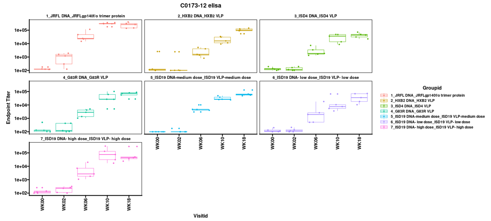

### Wrangling or i didn't know i had data stack capabilities.
Musings on Data munging and the development of ETL pipelines from biological data sources.

life in a biological lab is more than just the data and the insights developed as there are navigations that go unspoken about the data: the quality, the management and the personalities that control it. the stochasticity of the 'navigations' require advanced maths to even begin to address the complexity. 

some thoughts on the process of getting data into a format that works best for getting the most information (graphical output, EDA, statistical measures)

We will follow the first part of the below flow chart using the excel spreadsheet from the machine output paired with a VBscript to transform the data into a structure suitable for db schema: 

This will arrive at the destination of a dataset that is analyzed, aggregated, web accessible data set with advanced agile graphical outputs like the following: 

To get a sense of the remaining steps visit the dose response curve calculation steps in the [ELISA_DRC](https://github.com/aaronjwilson/immuno_data_analysis/blob/master/ELISA_DRC.md)

For this part i will focus on developments in excel vbscript but future discussions will follow the development of bespoke methods using alternative scripting/programming languages such as: 

R/Python 
Macros made in javascript for googlesheets or O365.

