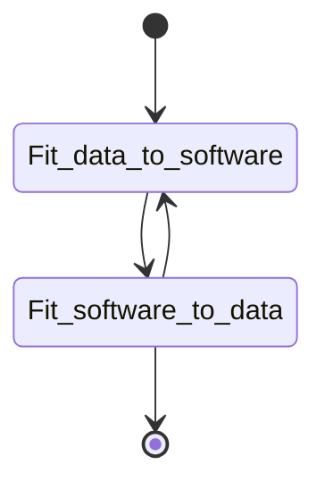

# Wrangling or i didn't know i had data stack capabilities.
life in a biological lab is more than just the data and the insights developed as there are navigations that go unspoken about the data: the quality, the management and the personalities that control it. the stochasticity of the 'navigations' require advanced maths to even begin to address the complexity. 

Musings on Data munging and the development of ETL pipelines from biological data sources.
https://upmath.me/

some thoughts on the process of getting data into a format that works best for getting the most information (graphical output, EDA, statistical measures)


when thinking about the tools that i use on the regular to bring data into a format that allows the easiest and most efficient method of getting the most amount of detail. timing is of the ssesnce. Excel is a great program. extended with visual basic is even better. <br>

GraphPad<br>
R<br>
Python<br>
Googlesheets macros.


VBscript for an excel macro to interact (ne deal) with the elisa data
```vbscript
Sub Gen5Row()

' loopish Macro
Range("A1:A1700").Select
Application.Run "DelEmptyRow"


Range("B3").Select
Do Until IsEmpty(ActiveCell.Offset(22, -1))
    ActiveCell.Range("A1,A4,A7,A10,A13,A16,A19,A22").Select
    Selection.Copy
    ActiveCell.Offset(22, -1).Range("A1").Select
    ActiveSheet.Paste
    ActiveCell.Offset(1, 1).Range("A1:L1").Select 'active cell A25
    Application.CutCopyMode = False
    Selection.Cut
    ActiveCell.Offset(-1, 12).Range("A1").Select
    ActiveSheet.Paste
        For i = 1 To 3
            ActiveCell.Offset(3, -12).Range("A1:L1").Select
            Selection.Cut
            ActiveCell.Offset(-1, 12).Range("A1").Select
            ActiveSheet.Paste
        Next i
   ActiveCell.Offset(12, -12).Range("A1").Select
Loop

    Range("O1:O1500").Select
    Application.Run "DelEmptyRow"


`Nomenclature built around direct naming and the name built into the sheet tab
Range("A1").EntireRow.Insert
Range("A:C").EntireColumn.Insert
Range("A1")="Protein"
Range("B1")="StudyID"
Range("C1")="Timepoint"
Range("D1")="Participantid"
Range("A2:A30") = Mid(ThisWorkbook.Name, 10, 15)
Range("B2:B30") = Mid(ThisWorkbook.Name, 1, 8)
Range("C2:C30") = ActiveSheet.Name
End Sub
```

```
'Attribute VB_Name = "DelEmptyRow"
Sub DelEmptyRow()
Rng = Selection.Rows.Count
ActiveCell.Offset(0, 0).Select
Application.ScreenUpdating = False
For i = 1 To Rng
If ActiveCell.Value = "" Then    'You can replace "" with 0 to delete rows with 'the value zero
Selection.EntireRow.Delete
Else
ActiveCell.Offset(1, 0).Select
End If
Next i
Application.ScreenUpdating = True
End Sub
```
```
Sub FileNomen()
'Range("A2") = Mid(ThisWorkbook.Name, 10, 15)
'Range("B2") = Mid(ThisWorkbook.Name, 1, 8)
'Range("C2") = ActiveSheet.Name
'Range("A2") = Mid(ThisWorkbook.Name, 12, 16)
'Range("B2") = Mid(ThisWorkbook.Name, 1, 10)

End Sub
```
